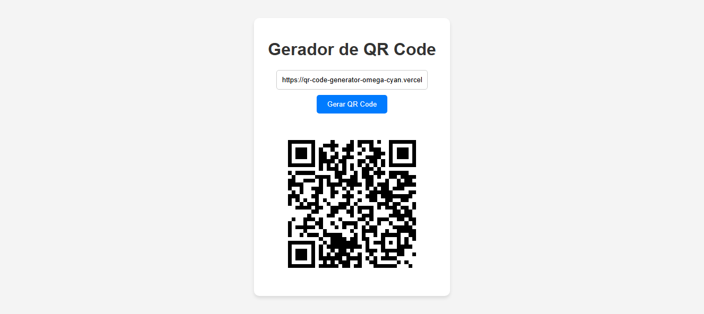

# Gerador de QR Code

Este é um projeto simples de um **Gerador de QR Code** feito em HTML, CSS e JavaScript.

## Objetivo

O site foi desenvolvido com o objetivo de aprender a trabalhar com APIs e integrar bibliotecas externas em projetos web. Para gerar os QR Codes, utilizei a biblioteca [qrcode](https://github.com/soldair/node-qrcode) via CDN.

## Como funciona

1. Digite um texto no campo indicado.
2. Clique em **Gerar QR Code**.
3. O QR Code correspondente ao texto será exibido na tela e estará disponível para download.

### Demonstração



Neste caso podemos ver um exemplo de uso onde o usuario insere o link https://qr-code-generator-omega-cyan.vercel.app e o site retorna o QRCode gerado.

## Tecnologias utilizadas

- HTML5
- CSS3
- JavaScript
- [qrcode](https://github.com/soldair/node-qrcode) (CDN)

### Instalação e Pré-requisitos

Este projeto é um site disponível online e não requer instalação de software adicional ou manipulação de arquivos locais. Você pode acessar o site diretamente através do seguinte link: [Acessar o Site](https://qr-code-generator-omega-cyan.vercel.app).

## Estrutura do Projeto

```
QRCode-Generator/
  │── README.md
  │── LICENSE
  │── assets/
  │   └── demonstration.png
  │   └── favicon.png
  └── public/
      ├── index.html
      ├── style.css
      └── script.js
```

## Licença

Este projeto está licenciado sob a MIT License - veja o arquivo [LICENSE](LICENSE) para mais detalhes.

---

Acesse o site em: **https://qr-code-generator-omega-cyan.vercel.app**
